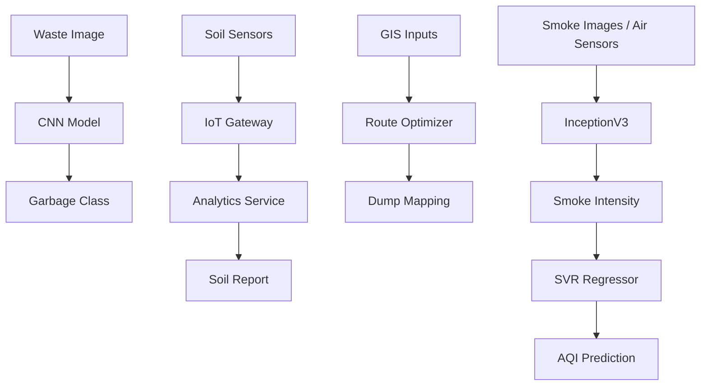

# 🌍 Enviro Scan
**Advancing Waste and Pollution Management through Comprehensive Air Pollution Analysis**

---

## 📑 Table of Contents
- [📖 Overview](#-overview)
- [🚀 Features](#-features)
- [🏗️ System Architecture](#️-system-architecture)
- [🖥️ Usage](#-usage)
- [📊 Datasets](#-datasets)
- [📈 Results](#-results)
- [🛠️ Tech Stack](#️-tech-stack)
- [🧱 Project Structure](#-project-structure)
- [📡 API Endpoints](#-api-endpoints)
- [🚧 Future Scope](#-future-scope)
- [🙌 Contributors](#-contributors)
- [📜 License](#-license)

---

## 📖 Overview
**Enviro Scan (PWPMI – Progressive Waste and Pollution Management Interface)** is a smart environmental monitoring and management platform developed as a **B.Tech Major Project (SRM Institute of Science & Technology, 2024)**. It integrates **AI, IoT, GIS, and Machine Learning** to address:

- ♻️ Garbage Classification  
- 🌱 Soil Quality Monitoring  
- 🗺️ Dump Collection Mapping  
- 🌫️ Air Pollution Analysis  

---

## 🚀 Features

### ♻️ Garbage Classification (CNN)
- Detects and classifies waste into: **Cardboard, Glass, Metal, Paper, Plastic, Trash**  
- Accuracy: **~85%**

### 🌱 Soil Quality Monitoring (IoT + Analytics)
- Monitors: **pH, moisture, N, P, K, humidity, rainfall**  
- Real-time anomaly detection  

### 🗺️ Waste Dump Mapping (GIS + Route Optimization)
- Maps dumpsites & optimizes collection vehicle routes  
- Reduces operational costs and hazards  

### 🌫️ Air Pollution Monitoring (Deep Learning + AQI Prediction)
- **InceptionV3** predicts smoke intensity levels (20% → 90%)  
- **Support Vector Regression (SVR)** predicts AQI with **MSE ≈ 19.01**  

### 💻 Web Dashboard (Flask)
- Modules: Garbage classification, AQI estimation, soil health check, dump mapping  
- User-friendly visualizations + alerts  

---

## 🏗️ System Architecture

### 🔹 Process Flow

## 🖥️ Usage

### Setup Environment
```bash
python -m venv .venv && source .venv/bin/activate   # (Windows: .venv\Scripts\activate)
pip install -r requirements.txt
```

### Prepare Models
Place trained weights under `models/`:
```
models/cnn_waste_classifier/
models/inceptionv3_smoke/
models/svr_aqi.joblib
```

## 📊 Datasets
- **Garbage Classification**: Kaggle Garbage Classification Dataset  
- **Air Pollution**: Smoke intensity dataset (20–90%)  
- **Soil Quality**: IoT simulated (NPK + pH + rainfall)  
- **GIS Data**: Dumpsite geo-coordinates + route traffic  

> ⚠️ Datasets are **NOT hosted** in repo due to size; external links provided.

---

## 📈 Results

### ⚡ Garbage Classification (CNN)
- Accuracy: **85.04%**
- Stronger on: **cardboard, metal, paper**
- Weaker on: **plastic, trash**

### 🌫️ Air Pollution (InceptionV3 + SVR)
- InceptionV3: **85% accuracy** (smoke detection)
- SVR AQI prediction:
  - **MSE**: 19.01
  - **Std Dev**: 3.96

### 🌱 Soil Monitoring
- Real-time anomaly detection  
- Soil status: **Good / Moderate / Poor**

### 🚛 Dump Mapping
- Optimized routes reduce **fuel & cost**

---

## 🛠️ Tech Stack
- **Language**: Python (3.8+)  
- **Frameworks**: TensorFlow/Keras, PyTorch, Flask, Scikit-learn  
- **Tools**: Google Colab, Roboflow, GIS Mapping  
- **Databases**: PostgreSQL / MongoDB (optional backend)  

---

## 🧱 Project Structure
```text
enviro-scan/
├─ app.py
├─ requirements.txt
├─ .env.example
├─ models/
│  ├─ cnn_waste_classifier/
│  ├─ inceptionv3_smoke/
│  └─ svr_aqi.joblib
├─ modules/
│  ├─ garbage_classifier.py
│  ├─ soil_monitor.py
│  ├─ air_quality.py
│  └─ route_mapping.py
├─ data/        # external datasets (gitignored)
├─ static/      # css/js only (no images)
├─ templates/   # Flask HTML templates
└─ docs/        # project documentation
```

---

## 📡 API Endpoints

### POST `/api/classify`
- **Input**: multipart `image`
- **Output**: `{ "class": "paper", "confidence": 0.91 }`

### POST `/api/aqi`
- **Input**: `{ "smoke_image": <file>, "temp": 30.1, "humidity": 68, "pm25": 87 }`
- **Output**: `{ "aqi": 142, "status": "Unhealthy for Sensitive Groups" }`

### POST `/api/soil`
- **Input**: `{ "pH": 6.8, "moisture": 24, "N": 50, "P": 30, "K": 40, "rainfall": 3.2 }`
- **Output**: `{ "status": "Moderate", "notes": "Increase K; maintain pH." }`

### GET `/api/routes`
- **Output**: optimized route GeoJSON/features

---

## 🚧 Future Scope
- 🔗 Blockchain-based waste tracking  
- 💧 Expand to water quality & biodiversity monitoring  
- ☁️ Cloud deployment (**AWS/GCP/Azure**)  
- 🤖 Predict future waste generation using advanced AI  

---

## 🙌 Contributors
- 👨‍💻 **Yaswanth G V N S** [RA2011003011161]  
- 👨‍💻 **Vamsi Krishna K** [RA2011003011160]  
- 🎓 **Guide**: Dr. S. S. Saranya, Assistant Professor, SRM University  

---

## 📜 License
This project was developed as an **academic research prototype**.  
For usage, contributions, or collaborations → create an **Issue/Pull Request**.
